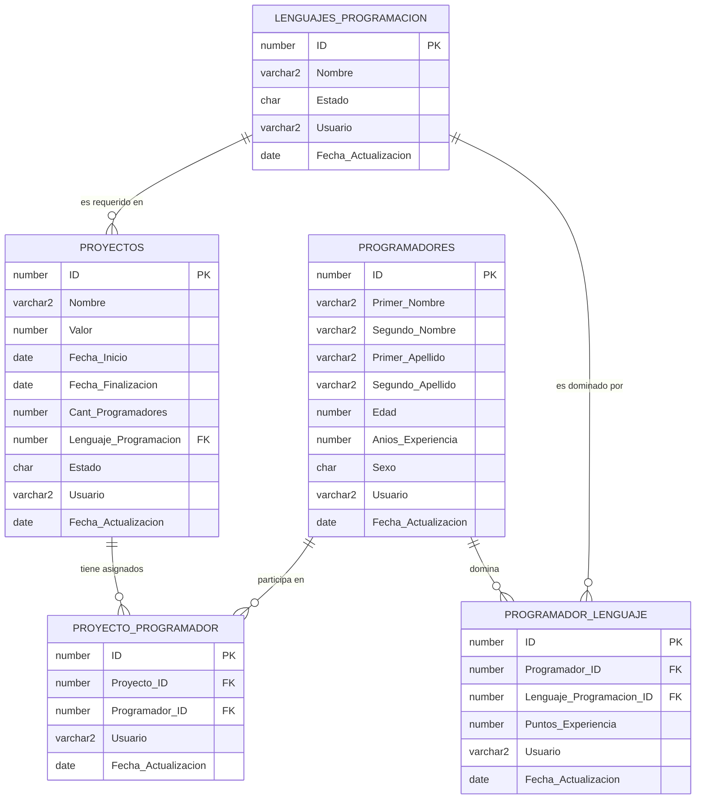

# Prueba Técnica PL/SQL 

## Descripción del Proyecto

Este proyecto es una solución completa para un sistema de gestión de proyectos y programadores utilizando Oracle PL/SQL. Implementa un modelo de datos normalizado, procedimientos almacenados, funciones, triggers y paquetes para manejar la asignación de programadores a proyectos, el seguimiento de sus habilidades en diferentes lenguajes de programación, y la gestión del estado de los proyectos.

## Requisitos del Sistema

Para ejecutar y trabajar con este proyecto, necesitarás:

1. **Oracle Database**: Se recomienda Oracle Database XE (Express Edition) 18c o superior.
2. **Docker Desktop**: Para ejecutar la base de datos Oracle en un contenedor (opcional pero recomendado).
3. **SQL Developer**: Para visualizar, ejecutar y debuguear scripts PL/SQL.

### Configuración del Entorno

1. **Instalar Docker Desktop**: 
   - Descarga e instala [Docker Desktop](https://www.docker.com/products/docker-desktop)

2. **Crear un contenedor Oracle XE (Si deseas instalar desde un contenedor) de lo contrario instala normalmente directamente en tu SO preferido**:
   ```bash
   docker pull container-registry.oracle.com/database/express:latest
   docker run -d -p 1521:1521 -e ORACLE_PWD=tu_contraseña container-registry.oracle.com/database/express:latest

### Estructura del Proyecto
   - El proyecto está organizado en las siguientes carpetas:
        1. **01_esquema**: Scripts para crear las tablas, secuencias y triggers.
        2. **02_datos_iniciales**:  Scripts para insertar datos de prueba.
        3. **03_funciones**:  Funciones PL/SQL.
        4. **04_procedimientos**:  Procedimientos PL/SQL.
        5. **05_paquetes**:  Paquetes PL/SQL.
        6. **06_tipos**:  Tipos de datos personalizados.

# Modelo de datos normalizado

## Formas Normales Aplicadas

### Primera Forma Normal (1NF):
- Cada tabla tiene una clave primaria (ID).
- No hay grupos repetitivos o columnas múltiples con datos similares.

### Segunda Forma Normal (2NF):
- Todas las columnas no clave dependen completamente de la clave primaria.

### Tercera Forma Normal (3NF):
- No hay dependencias transitivas. Cada atributo no clave depende directamente de la clave primaria.

### Normalización de relaciones muchos a muchos:
- Se han creado tablas intermedias (Programador_Lenguaje y Proyecto_Programador) para manejar las relaciones muchos a muchos entre Programadores y Lenguajes, y entre Programadores y Proyectos.

## Aspectos destacables de la normalización

1. **Separación de entidades:** Tablas separadas para Lenguajes_Programacion, Programadores y Proyectos.

2. **Relaciones bien definidas:** Uso de claves foráneas para establecer relaciones entre tablas.

3. **Tablas de unión:** Programador_Lenguaje y Proyecto_Programador manejan las relaciones muchos a muchos.

4. **Restricciones de integridad:** Inclusión de CHECK constraints para validar datos como Estado, Sexo, y rangos numéricos.

5. **Campos de auditoría:** Inclusión de Usuario y Fecha_Actualizacion en cada tabla.

# Modelo de Datos Normalizado

## Gráfico de Entidad-Relación (ER)

El siguiente diagrama muestra el modelo Entidad-Relación de nuestra base de datos normalizada:



## Diagrama de Componentes PL/SQL

El siguiente diagrama muestra la estructura de los componentes PL/SQL de nuestro sistema, incluyendo paquetes, secuencias, triggers y cursores:

```mermaid
classDiagram
    class pkg_programador_proyecto {
        <<Package>>
        +programador_proyecto_record
        +programador_proyecto_table
        +get_programadores_promedio()
        +asignar_lenguajes_programadores()
        +asignar_programadores_proyectos()
        +imprimir_programadores_promedio()
        +actualizar_proyectos_terminados()
    }
    class Secuencias {
        <<Database Objects>>
        seq_lenguajes_programacion
        seq_programadores
        seq_proyectos
        seq_programador_lenguaje
        seq_proyecto_programador
    }
    class Triggers {
        <<Database Objects>>
        trg_lenguajes_programacion_bi
        trg_programadores_bi
        trg_proyectos_bi
        trg_programador_lenguaje_bi
        trg_proyecto_programador_bi
    }
    class Cursor {
        <<Explicit Cursor>>
        c_proyectos_menor_valor
    }
    pkg_programador_proyecto --> Secuencias : usa
    pkg_programador_proyecto --> Triggers : interactúa con
    pkg_programador_proyecto --> Cursor : utiliza en actualizar_proyectos_terminados

     
